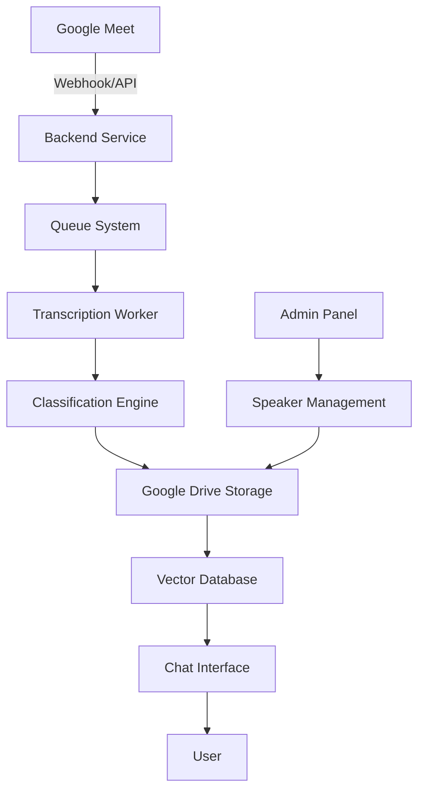

# MeetingHub - Documento de Contexto para Implementação

## 1. Visão Geral do Projeto

### Problema
Empresas perdem informações críticas de reuniões no Google Meet por falta de transcrição e organização automática. Decisões, responsáveis e prazos se perdem no tempo.

### Solução
Sistema automatizado que captura gravações do Google Meet, transcreve o áudio, organiza por projetos e oferece interface de busca contextual para recuperar informações específicas de reuniões passadas.

## 2. Arquitetura do Sistema Completo (Visão Final)



### Componentes Principais
1. **Capture Service**: Monitora e baixa gravações do Google Meet
2. **Transcription Pipeline**: Converte áudio em texto com identificação de speakers
3. **Classification System**: Organiza reuniões por projeto/cliente
4. **Storage Layer**: Drive para arquivos, DB para metadados
5. **Search Interface**: Chat que responde perguntas sobre reuniões
6. **Admin Panel**: Gerenciamento de speakers e projetos

## 3. MVP - Especificação Técnica Detalhada

### 3.1 Escopo do MVP
O MVP deve ser um sistema funcional que:
1. Acesse gravações do Google Meet via API
2. Transcreva áudio para texto
3. Organize transcrições em pastas no Drive
4. Funcione de forma automatizada para novas reuniões

### 3.2 Fluxo de Dados do MVP

```python
# Pseudocódigo do fluxo principal
def process_meeting_flow():
    # 1. Buscar reuniões finalizadas
    meetings = google_meet_api.get_ended_meetings(since=last_check)
    
    # 2. Para cada reunião
    for meeting in meetings:
        # 3. Baixar gravação/áudio
        recording = google_meet_api.get_recording(meeting.id)
        
        # 4. Transcrever
        transcript = transcribe_audio(recording)
        
        # 5. Classificar projeto
        project = classify_by_title(meeting.title)
        
        # 6. Salvar no Drive
        path = f"/MeetingHub/{project}/{meeting.date}/"
        save_to_drive(transcript, path, meeting.metadata)
```

### 3.3 APIs e Integrações Necessárias

#### Google Workspace APIs
```javascript
// APIs requeridas
- Google Meet REST API v2
- Google Drive API v3
- Google Calendar API (opcional)
- Admin SDK (para gerenciar permissões)

// Scopes necessários
- https://www.googleapis.com/auth/meetings.space.readonly
- https://www.googleapis.com/auth/drive.file
- https://www.googleapis.com/auth/calendar.readonly
```

#### Transcription Options
```python
# Opção 1: Google Speech-to-Text
from google.cloud import speech_v1

# Opção 2: OpenAI Whisper
import whisper

# Opção 3: WhisperX (com diarização)
import whisperx
```

### 3.4 Estrutura de Dados

#### Meeting Document (Markdown)
```markdown
# Reunião: [TÍTULO]
**Data:** 2025-10-31
**Participantes:** João Silva, Maria Santos, Pedro Costa
**Duração:** 45 minutos
**Projeto:** PROJETO_X

## Transcrição

**[00:00:15] João Silva:** Vamos começar discutindo o cronograma...
**[00:01:30] Maria Santos:** Concordo, mas precisamos considerar...
**[00:02:45] Pedro Costa:** A decisão final seria então...

## Resumo (gerado por IA)
- Decisão sobre cronograma: Entregas quinzenais
- Responsável pelo design: Maria Santos
- Próxima reunião: 07/11/2025
```

#### Metadata Structure (JSON)
```json
{
  "meeting_id": "abc-defg-hij",
  "title": "[PROJETO_X] Daily Standup",
  "date": "2025-10-31T10:00:00Z",
  "duration_minutes": 45,
  "participants": [
    {"email": "joao@empresa.com", "name": "João Silva", "speaker_id": "speaker_1"},
    {"email": "maria@empresa.com", "name": "Maria Santos", "speaker_id": "speaker_2"}
  ],
  "project": "PROJETO_X",
  "transcript_url": "drive.google.com/file/...",
  "recording_url": "drive.google.com/file/...",
  "key_decisions": [],
  "action_items": []
}
```

### 3.5 Configuração Inicial

#### Environment Variables
```bash
# Google APIs
GOOGLE_MEET_API_KEY=
GOOGLE_SERVICE_ACCOUNT_JSON=
GOOGLE_DRIVE_FOLDER_ID=

# Transcription
TRANSCRIPTION_SERVICE=whisperx  # whisperx|google|openai
WHISPER_MODEL=large-v3
OPENAI_API_KEY=  # se usar whisper API

# Classification
DEFAULT_PROJECT=GERAL
PROJECT_RULES_JSON=./projects.json

# System
POLL_INTERVAL_MINUTES=15
MAX_CONCURRENT_JOBS=3
TEMP_STORAGE_PATH=/tmp/meetings
```

#### Project Rules (projects.json)
```json
{
  "rules": [
    {
      "type": "prefix",
      "pattern": "[VNO]",
      "project": "VNO",
      "folder_id": "drive_folder_id_1"
    },
    {
      "type": "domain",
      "pattern": "@cliente.com",
      "project": "CLIENTE_X",
      "folder_id": "drive_folder_id_2"
    },
    {
      "type": "keyword",
      "keywords": ["onboarding", "kickoff"],
      "project": "NOVOS_CLIENTES",
      "folder_id": "drive_folder_id_3"
    }
  ],
  "default_project": "GERAL",
  "default_folder_id": "drive_folder_id_default"
}
```

## 4. Sistema Completo - Funcionalidades Futuras

### 4.1 Interface de Chat
```typescript
// Exemplo de query para o chat
interface ChatQuery {
  question: "Quando decidimos mudar o prazo de entrega?",
  context: {
    project: "PROJETO_X",
    date_range: "last_30_days",
    participants: ["João Silva"]
  }
}

// Resposta esperada
interface ChatResponse {
  answer: "Na reunião de 15/10/2025, João Silva propôs e todos concordaram em estender o prazo para 30/11.",
  sources: [
    {
      meeting_id: "abc-123",
      timestamp: "00:15:30",
      speaker: "João Silva",
      excerpt: "Precisamos de mais 15 dias para garantir qualidade"
    }
  ]
}
```

### 4.2 Speaker Management
```python
# Sistema deve permitir:
1. Identificar speakers únicos por voz
2. Associar speaker_id com nome/email
3. Mesclar speakers duplicados
4. Treinar modelo com vozes conhecidas

# Interface admin
/admin/speakers
  - Lista todos os speakers identificados
  - Permite renomear: "speaker_1" → "João Silva"
  - Permite mesclar: "speaker_1" + "speaker_2" → "João Silva"
  - Upload de áudio de referência para cada pessoa
```

### 4.3 Busca Semântica
```python
# Usar embeddings para busca contextual
from sentence_transformers import SentenceTransformer

# Indexar cada parágrafo da transcrição
model = SentenceTransformer('all-MiniLM-L6-v2')
embeddings = model.encode(transcript_paragraphs)

# Buscar por similaridade
query = "discussão sobre orçamento"
results = vector_db.similarity_search(query, top_k=5)
```

## 5. Stack Técnico Recomendado

### MVP (Fase 1)
```yaml
Backend:
  - Python 3.11+
  - FastAPI
  - Google API Client
  - WhisperX
  
Storage:
  - SQLite (metadados)
  - Google Drive (arquivos)
  
Deploy:
  - Docker
  - Google Cloud Run
```

### Sistema Completo (Fase 2+)
```yaml
Backend:
  - FastAPI + Celery
  - PostgreSQL
  - Redis (cache/queue)
  
Frontend:
  - Next.js 14
  - Tailwind CSS
  - Shadcn/ui
  
AI/ML:
  - OpenAI GPT-4
  - Pinecone/Weaviate (vector DB)
  - LangChain
  
Deploy:
  - Google Cloud Platform
  - Cloud Run + Cloud SQL
```

## 6. Requisitos e Restrições

### Técnicas
- Latência máxima: 10 minutos do fim da reunião até transcrição disponível
- Precisão mínima de transcrição: 95%
- Suporte a reuniões de até 3 horas
- Identificação de até 20 speakers diferentes

### Negócio
- Custo máximo por reunião: R$ 2,00
- LGPD compliance obrigatório
- Retenção de dados: 2 anos
- Multi-tenant: suportar múltiplas empresas

## 7. Processo de Desenvolvimento

### Milestone 1: MVP Funcional (2 semanas)
- [ ] Setup Google APIs e autenticação
- [ ] Pipeline de transcrição básica
- [ ] Organização automática no Drive
- [ ] Script de monitoramento

### Milestone 2: Automação (1 semana)
- [ ] Webhook para novas reuniões
- [ ] Processamento em background
- [ ] Tratamento de erros
- [ ] Logs estruturados

### Milestone 3: Interface Web (2 semanas)
- [ ] Frontend básico
- [ ] Busca em transcrições
- [ ] Gestão de speakers
- [ ] Dashboard de métricas

### Milestone 4: IA e Chat (2 semanas)
- [ ] Integração com LLM
- [ ] Interface de chat
- [ ] Busca semântica
- [ ] Geração de resumos

## 8. Questões que Precisam de Esclarecimento

### Acesso e Permissões
1. **Conta Google Workspace**: Qual conta/domínio será usado? É uma conta com privilégios de admin?
2. **Gravações existentes**: Onde estão armazenadas atualmente? Temos acesso a todas?
3. **Participantes externos**: Como lidar com reuniões que incluem pessoas fora da organização?

### Dados e Privacidade
4. **Consentimento**: Todos os participantes consentem com a gravação e transcrição?
5. **Retenção**: Por quanto tempo manter transcrições? Há requisitos legais?
6. **Anonimização**: Precisamos anonimizar dados sensíveis nas transcrições?

### Técnicas
7. **Volume esperado**: Quantas reuniões por dia/semana precisam ser processadas?
8. **Idiomas**: Apenas português ou multi-idioma?
9. **Qualidade de áudio**: As gravações têm boa qualidade ou precisamos de pré-processamento?

### Integrações
10. **Notificações**: Enviar resumos por email/Slack após processamento?
11. **CRM/ERP**: Integrar com outros sistemas da empresa?
12. **Autenticação**: Usar Google SSO ou sistema próprio?

### Funcionalidades
13. **Edição manual**: Permitir correção manual das transcrições?
14. **Compartilhamento**: Transcrições devem ser compartilháveis externamente?
15. **Análise**: Gerar métricas (tempo de fala por pessoa, palavras mais usadas, etc)?

### Infraestrutura
16. **Hospedagem**: Preferência por cloud provider (GCP, AWS, Azure)?
17. **Backup**: Estratégia de backup além do Google Drive?
18. **SLA**: Qual disponibilidade esperada (99%, 99.9%)?

---

**IMPORTANTE**: Este documento deve ser tratado como a fonte única de verdade para o desenvolvimento. Qualquer mudança significativa deve ser refletida aqui. O agente IA deve consultar este documento sempre que precisar entender o contexto macro do projeto ou tomar decisões arquiteturais.

**PRÓXIMO PASSO**: Responder as questões acima para que o desenvolvimento possa iniciar com todas as informações necessárias.